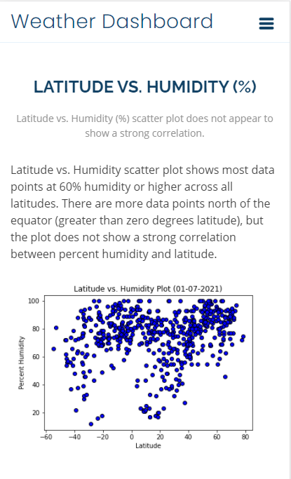
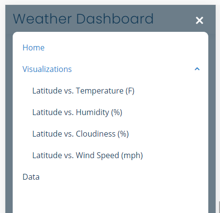

# Web Design Challenge - Web Visualization Dashboard (Latitude)

## Background

Data is more powerful when we share it with others! Let's take what we've learned about HTML and CSS to create a dashboard showing off the analysis we've done.

## Latitude - Latitude Analysis Dashboard with Attitude

For this challenge a visualization dashboard website was created using visualizations that were created in a past challenge. Specifically, [WeatherPy](https://github.com/melissamonroe/python-api-challenge) and [weather data](resources/city_weather.csv).

In building this dashboard, pages for visualizations, project summary and project data were created and a means by which we can navigate between them. These pages contain the visualizations and their corresponding explanations.

### Website Details

For reference, see the ["Screenshots" section](#screenshots) below.

The website consists of the following pages:

* A [Landing page](#landing-page) containing:
  * An explanation of the project.
  * Links to each visualizations page. Preview images of each plot, and clicking an image takes the user to that visualization.
* Four [Visualization Details pages](#visualization-pages), each with:
  * A descriptive title and heading tag.
  * The plot/visualization itself for the selected comparison.
  * A paragraph describing the plot and its significance.
* A [Visualizations Summary page](#visualizations) that:
  * Contains all of the visualizations on the same page so we can easily visually compare them.
* A [Data page](#data-page) that:
  * Displays a responsive table containing the data used in the visualizations.
    * The table must be a bootstrap table component. [Resources](https://getbootstrap.com/docs/4.3/content/tables/#responsive-tables)
    * The data comes from or converting the csv it to HTML. Pandas has a method approprately called `to_html` that allows you to generate a HTML table from a pandas dataframe. See the documentation [here](https://pandas.pydata.org/pandas-docs/version/0.17.0/generated/pandas.DataFrame.to_html.html)

The weather dashboard website has, at the top of every page, a navigation menu that:

* Has the name of the site on the left of the nav which allows users to return to the landing page from any page.
* Contains a dropdown menu on the right of the navbar named "Visualizations" that provides a link to each individual visualization page.
* Provides link "Data," which links to the data page.
* Is responsive (using media queries).

### Screenshots

This section contains screenshots of each page/section that was built, at varying screen widths. 

#### Landing page

Large screen:

Small screen:



#### Visualization Summary page 

Large screen:

Small screen:

####  Visualization Details pages
Large screen:

Small screen:

#### Data page

Large screen:

Small screen:

#### Navigation menu

Large screen:

Small screen:

